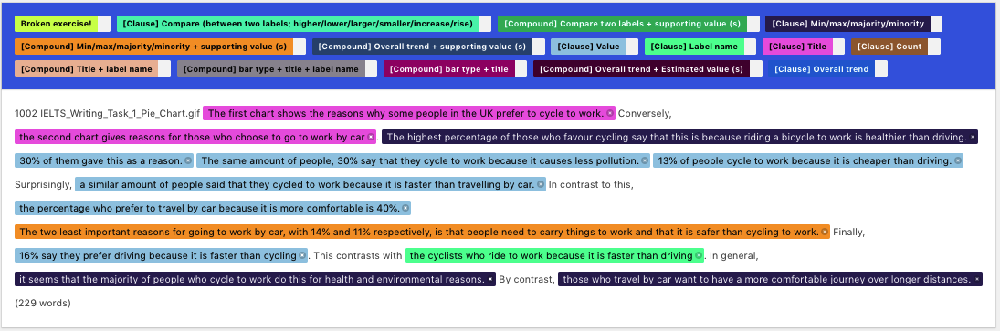

# Corpus Analysis Annotation Guideline

## Table of Contents 

* Selection Procedure for Tags	
* Initial Annotation Guideline	
    - The Old Word/phrase-level Annotation Example	
    - Annotation Guideline	
* Switching the Annotation Level	
    - Annotator 2 Raising Concerns	
    - The First Author Addressing Concerns	
    - Annotator 2 Consenting	
* Revision to Annotation Guideline	
* Final Guideline
    - A Final Annotation Example
 
## Selection Procedure for Tags

The first author (FA) piloted annotating a subset of captions on the word/phrase-level, until saturation, which resulted in the 8 single-type tags in Figure 1. This process is very similar to qualitatively coding. FA summarized it as an “Initial Annotation Guideline” and sent out emails that point annotators to the interface, the guideline, and the example. One annotator proposed changing the annotation level into clause/sentence (Section 2.1), a necessary level of output unit to inform designing a captioning system. Facing difficulties tagging clauses/sentences with multiple intertwined aspects, we then piloted (until saturation) to add the 7 compound tags in Figure 1. Annotators were encouraged to add new tags during annotation, but none were added. 

Among the 8 single-type tags, FA populated “Count” as one of the 8 single-type tags. This is because that before seeing any realistic captions, FA considers it necessary to describe number of elements in figure captions. However, spans of “Count” never showed up in the corpus, so in the final annotation guideline, this tag disappeared.  

## Initial Annotation Guideline

### The Old Word/phrase-level Annotation Example

### Annotation Guideline

#### Introduction

In this task, you are invited to tag word spans into different caption unit types. This annotation is to conduct a small-scale corpus analysis on human caption. 

Our hypothesis is that natural and complex human caption paragraphs consist of small, fundamental caption units, whose types are a finite set such as comparison, presenting a value, min/max, re-iterating the title, insights/trends.

#### Metadata information

To get started with each annotation, the paragraph starts with some metadata information, including
- Exercise identifier, 
- Writing hints, 

Please use these information to locate the actual figures from this pdf [pdf_url]. Note that some figures break in half by pdf page boundaries.

Alternative, you may download figures from [google_drive_link]. The directory is ~5MB. 

If a paragraph lacks corresponding figure, or is presenting a raw table, please tag the exercise identifier as "Broken (this exercise lacks figure OR is a table)". Otherwise, there is no need to tag these metadata information. 

#### Example

For example, the first caption paragraph starts with a sentence "1002 IELTS_Writing_Task_1_Pie_Chart.gif You should spend about 20 minutes on this task. Write at least 150 words.". 1002 and the .gif filename. 

#### Adding new tags

We encourage you to add new tags if some span is a functional caption unit that does not fit into these categories. 

Please feel free to add new tags into the set (to add new tags, please visit "Projects" on the right corner" -> "Labels" on the left bar), and add corresponding tag definition and name in the "Projects" -> "Guideline" (section "Definition of tags") . 

For example, as an open question, do we need a tag called "transition word"? 

#### Definition of tags

Below are the list of pre-defined tags and their definition. 

1. Compare (between two values, e.g. higher, lower, larger, smaller):

span that describe the comparative value of two elements in the figure.

2. Count # of element:

span that describe the number of elements (bars, lines) in the figure. 

3. Figure type (horizontal/vertical, bar, pie, line chart):

span that describe the type of the figure.

4. Label name (or a re-description of ...):

span that mention the label name of an element, usually on the axis (if a bar chart), or on the legend (if a pie chart). 

5. Minimum/maximum/majority/minority:

span that mention the maximum or minimum element in the figure.

6. Value (presenting a value):

span that presents the value of an element in the figure, e.g. "30% of people prefer cycling because it is healthier". 

7. Title (or a re-description of ...):

span that describes/re-iterates the title of the figure. 

8. Trend/insight (usually across many labels):

span that describe a high-level insight of the figure.

9. Broken (this exercise lacks figure OR is a table)

tag the exercise identifier (3-4 digits at the beginning) as broken exercise. 

#### Final note

In the previous iteration, we hear comments about 

"Sometimes it is hard to distinguish when to tag "Compare" vs. "Trend/Insight", because trend/insight statements are mostly based on value comparison...."

A: In this iteration, we define "Compare" are describing two or three (essentially, a few) labels. While "Trend/insight" usually describe across many labels, in a macro scale. 

"I found that many of "label names" are mentioned when it is "presenting values". Those two tags co-occur a lot too."

A: In this iteration, we encourage you to tag the minimum unit for each tags. If a sentence is "the percentage who prefer to travel by car because it is more comfortable is 40%", then "prefer to travel by car" is a "label name" and "40%" is "value". . 

Once again, thanks for your annotation!

## Switching the Annotation Level 

### Annotator 2 Raising Concerns

“Thanks for sharing this. I have a question. Do you expect to have word (or phrase)-level annotations? If the purpose of this study is getting insight about the flow of caption sentences in the paragraph. I think the annotation should be sentence-level (of course there could be some difficult cases to annotate, but if there are two options of mixed annotation per words or an annotation for sentence, I think we should prefer the latter). I don’t think annotations like value - trend – value - value - legends might not be helpful in that sense. but according to your example, it seems that you did per word in many cases mainly for labels and values. How do you think?”

“More importantly, however, I think the tag of ‘value’ or ‘label’ in the annotation task and those for the caption type have totally different meaning, right? The former indicates a specific word or phrase corresponding values or labels in the figure, but the latter is the type of a caption sentence that ‘explains’ which labels (or values) and how many of them are exist in the figure. It isn’t restricted to one specific value or label. This caption is able to have multiple of values or captions. Therefore I think we cannot use the finding from this study for generating caption unit if we allow mixed annotation on word and sentence, so annotation should be done per sentence. Different from that example, I think chart type and title can be exist in one sentence (which corresponds to your first example “the pie chart shows …”) because they still indicates the type of caption sentence, not a specific word or phrase. For “between 2010 and 2012, the sales rose significantly to 70%” yes, it could be either of comparison or value as you said (or trend). But I think still it should be one of them per participant or at least multiple tags for the sentence, not word-/phrase-level tag.
 
For the second, given the same figure, I think people can have similar tendency on the sentence flow when they write a caption paragraph and that is why we are doing this study. However, I don’t think there is a word-level flow in a sentence which influences the overall flow in the paragraph for a given figure or context. This is more likely selecting one of many possible templates like we’ve done so far. If you want to learn and leverage this word-level flow, I think there should be a separate study. This is just my rough thought, so we can discuss more or verify through the user study.
 
For the third, I’m not sure word-level annotation would be helpful to this interactive system. I think sentence-level interaction might be much easier and comprehensive.
 
As a minor comment, it would be good if you can delete first few sentences which are the same (the instruction for test) for all cases.”

### The First Author Addressing Concerns 

“Agreed with you suggestion on sentence level annotation. Not word level - it looks a bit petty too.

The instruction can be distracting - I will go ahead and delete the instruction for test. 

Please pardon two extra questions: for a sentence like "In 1955, the youngest age group had the fewest number / amount of weight issues, with more than 70% of 20-29-year-olds being assessed as having a healthy weight.” Do you think half-sentence (or clause-level) level tagging helpful? The former is a "min/max", the latter is a “value". I think knowing there are two different tags, the flow of one after another is helpful. 

For a sentence like "between 2010 and 2012, the sales rose significantly to 70%”, How about a hybrid tag named “trend+value” or “compare+value" is helpful. Since tagging word-level loses the composition nature of the sentence. 

If yes to both questions, how about this revised guideline below? If the guideline looks good, I will modify the interface and let you know. If no to either question, please let me know too.

1. Add hybrid tags to allow compound/mixed types of captions (trend + value, compare + value, figure-type+title, etc.) 
2. Spans is mostly sentence-level, but does not necessarily need to be the whole sentence (from beginning to period). Transition word shall be excluded at best effort. 
3. Spans could be at half-sentence (clause) level, separated by comma”

### Annotator 2 Consenting

“I would say yes to both questions. For the first sentence, I think that sentence can be considered as ‘min/max’ and ‘value’ one after another or one sentence with two tags. All the guidelines are looking good. Thanks.”

## Revision to Annotation Guideline

All other parts of the guideline stay the same, except we added tag sets such as “[Single] min/max”, “[Single] value”, and “[Compound] min/max + value”. To differentiate [Single] vs. [Compound], here are three examples:

1. For a sentence like "In 1955, the youngest age group had the fewest weight issues, with more than 70% of 20-29-year-olds being assessed as having a healthy weight.” 

Generally, single level tags would be very helpful to post-hoc analysis. Nevertheless, it is a tradeoff between granularity for analysis and cognitive load for you to annotate, whichever feels comfortable to you.

2. Compound tags seem more preferred for punctuation-inseparable sentences like “The two least important reasons for going to work by car, with 14% and 11%, is that people need to ...”. 

3. I felt challenging about the sentence "Smoke levels increased a little more sharply during this time and peaked in 1900 at about 500 micrograms.”. Which I tag as “[Single] Overall trend” followed by “[Compound] Maximum + value”. 

## Final Guideline 

### The Final Annotation Examples

### Introduction

In this task, you are invited to tag clause-level or sentence-level spans into different caption types. Clauses are comma-separated half sentence. This annotation is to conduct a small-scale corpus analysis on human captions. 

Metadata information to locate exercise

For each annotation, the paragraph starts with some metadata information, including

- Exercise ID, 
- IELTS exercise writing hints (optional, some may have, some may not)
 
Please use the exercise ID to locate the actual figures from this pdf [URL]. Note that some figures break in half by pdf page boundaries.
If a paragraph lacks corresponding figure from the pdf, or is presenting a raw table, please tag the exercise identifier as "Broken exercise". If the figure is present, there is no need to tag any metadata information. 

### Example

For example, one caption paragraph starts with a sentence "1002 IELTS_Writing_Task_1_Pie_Chart.gif You should spend about 20 minutes on this task. Write at least 150 words.". 1002 and the .gif filename. The rest are writing hints. 

### Adding new tags

We encourage you to add new tags if some span does not fit into existing tags. Existing tags are defined as below. If you add new tags, please let the admin know about it too. 

To add new tags, please visit "Projects" on the right corner" -> "Labels" on the left bar), and add corresponding tag definition and name in the "Projects" -> "Guideline" (section "Definition of tags"). 

### Q & A

Q: "Sometimes it is hard to distinguish "Compare" vs. "Trend", because trend/insight statements are mostly based on value comparison...." How to distinguish? 

A: We define "Compare" are describing two or three (essentially, a few) labels. While "Trend" usually describe across many labels, in a macro scale. 

### Definition of tags

Aside from the “Broken exercise” auxiliary tag, we have two types of tags. “Single” tag and “Compound” tag. E.g. in the interface, you would see “[Single] min/max”, “[Single] value”, and “[Compound] min/max + value”. 

The difference between “[Single] …” tag and “[Compound]" tag:

1. Within a sentence, please use "[Single] … " tag if there are multiple clauses who are separable and independently meaningful from each other, where each maps to one “[Single] XXX” tag, i.e. tags occur one after another, sequentially. E.g. "In 1955, the youngest age group had the fewest weight issues, with more than 70% of 20-29-year-olds being assessed as having a healthy weight.” has first [Single] max/min/majority/minority then [Single] value. 

2.  “[Compound] ” tags are for cases when clauses are not independently meaningful to be tagged as a "[Single] " tag. E.g. “The two least important reasons for going to work by car, with 14% and 11%, is that people need to …” whose tag is “[Compound] Max/min + supporting value". "with 14% and 11%" is not a clause, and it is embedded in a max/min description. 

For [Single] tags, the definitions are as follows: 

1. [Single] Compare (between *two* values, e.g. higher, lower, larger, smaller):

span that describe the comparative value of two elements in the figure.

2. [Single] Count:

span that describe the number of elements (bars, lines) in the figure. 

3. [Single] Figure type (horizontal/vertical, bar, pie, line chart):

span that describe the type of the figure.

4. [Single] Label name (or a re-description of ...):

span that mention the label name of an element, usually on the axis (if a bar chart), or on the legend (if a pie chart). 

5. [Single] Minimum/maximum/majority/minority:

span that mention the maximum or minimum element in the figure.

6. [Single] Value (presenting a value or a supporting value):

span that presents the value of an element in the figure, e.g. "30% of people prefer cycling because it is healthier". 

7. [Single] Title (or a re-description of ...):

span that describes/re-iterates the title of the figure. 

8. [Single] Overall trend (usually across more than two labels):

span that describe a high-level insight of the figure.

9. Broken (this exercise lacks figure OR is a table)

tag the exercise identifier (3-4 digits at the beginning) as broken exercise. 

